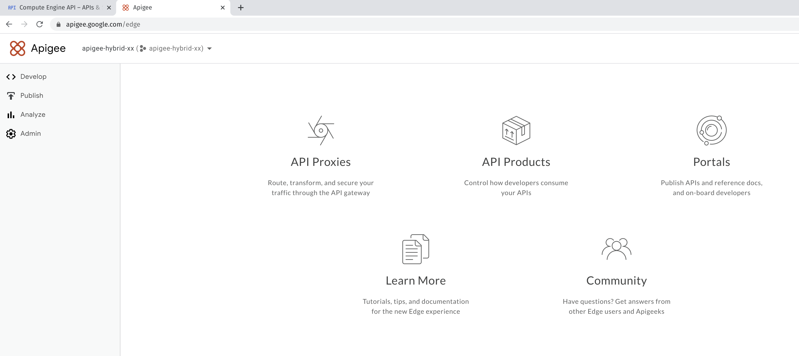
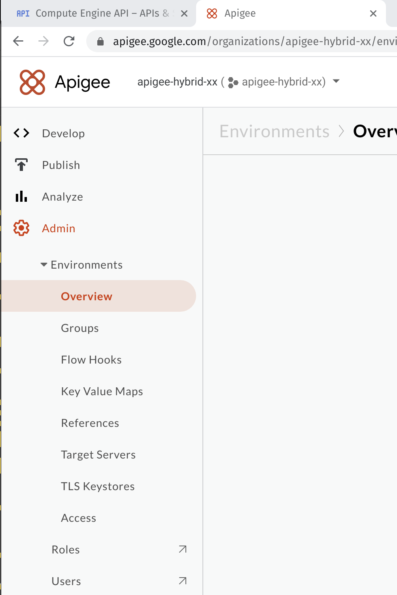
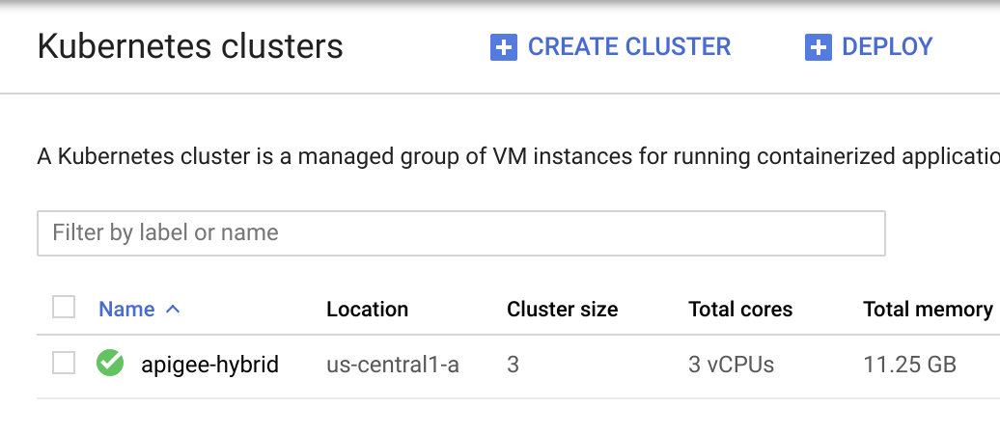

# Apigee Hybrid on GCP

**Index**
- [Apigee Hybrid on GCP](#apigee-hybrid-on-gcp)
  - [Overview](#overview)
- [Enable Google Cloud APIs](#enable-google-cloud-apis)
  - [Enable the necessary APIs](#enable-the-necessary-apis)
- [Create the Apigee hybrid organization](#create-the-apigee-hybrid-organization)
  - [Create the hybrid organization](#create-the-hybrid-organization)
- [Create an environment in the Apigee hybrid UI](#create-an-environment-in-the-apigee-hybrid-ui)
  - [Create the test environment](#create-the-test-environment)
- [Set up your work environment](#set-up-your-work-environment)
  - [Configure environment variables](#configure-environment-variables)
- [Create GKE Cluster](#create-gke-cluster)
- [Authenticate to the Apigee hybrid cluster](#authenticate-to-the-apigee-hybrid-cluster)
  - [Authenticate to the cluster](#authenticate-to-the-cluster)
- [Install the hybrid software](#install-the-hybrid-software)
  - [Download and extract the hybrid distribution](#download-and-extract-the-hybrid-distribution)
  - [Set up the directories](#set-up-the-directories)
  - [Create a home for hybrid files](#create-a-home-for-hybrid-files)
- [Create service accounts](#create-service-accounts)
  - [Create the first service account](#create-the-first-service-account)
  - [Create the first service account](#create-the-first-service-account-1)
  - [Create service accounts for the remaining runtime components](#create-service-accounts-for-the-remaining-runtime-components)
  - [Configure the MART service account for Apigee Connect](#configure-the-mart-service-account-for-apigee-connect)
- [Retrieve TLS certificate](#retrieve-tls-certificate)
  - [Copy the certificate from Cloud Storage](#copy-the-certificate-from-cloud-storage)
- [Configure the cluster](#configure-the-cluster)
- [Install hybrid runtime components](#install-hybrid-runtime-components)
  - [Initialize the cluster with system components](#initialize-the-cluster-with-system-components)
  - [Install the hybrid workloads into the cluster](#install-the-hybrid-workloads-into-the-cluster)
- [Management plane configuration](#management-plane-configuration)
  - [Enable Synchronizer access](#enable-synchronizer-access)
  - [Configure the MART endpoint](#configure-the-mart-endpoint)

## Overview

Install and configure the Apigee hybrid runtime plane in a cluster on Google Kubernetes Engine (GKE) in Google Cloud. The hybrid deployment model enables you to deploy and manage the Apigee runtime in Kubernetes containers, while Apigee hosts the management plane in Google Cloud.

# Enable Google Cloud APIs

Verify that certain Google Cloud and Apigee APIs are enabled for your project using the Google Cloud Console
1. Apigee API: Provides communications between your project and other hybrid services and Google Cloud APIs.
2. Apigee Connect API: Enables communication between the Apigee management and runtime planes.
3. Cloud Resource Manager API: Validates service accounts used by Apigee hybrid.
4. Compute Engine API: Used for cluster management.

## Enable the necessary APIs
1. Sign in to Google Cloud Console using you credentials: **https://console.cloud.google.com/**
2. In the Cloud Console, on the Navigation menu (), click APIs & Services > Library.
3. In the Search for APIs & Services box, type Apigee to see a list of Apigee APIs.
4. Click on the Apigee API.
5. If the Apigee API isn't enabled, click Enable.
6. Repeat for Apigee Connect API, Cloud Resource Manager API y Compute Engine API

```
gcloud services enable \
    apigee.googleapis.com \
    apigeeconnect.googleapis.com \
    cloudresourcemanager.googleapis.com \
    compute.googleapis.com
```


# Create the Apigee hybrid organization

To use Apigee hybrid, you must create an organization resource bound to your Google Cloud project. In this task, you execute a script that calls an Apigee management API to create the organization.

**https://docs.apigee.com/hybrid/v1.2/precog-provision**

## Create the hybrid organization

1. On the Google Cloud Platform menu, click Activate Cloud Shell ()
2. Copy the script from Cloud Storage to your home directory:
   ```
   gsutil cp gs://cloud-training/CBL240/provision_hybrid_org.sh .
   ```
3. Make the script executable:
   ```
   chmod a+x ./provision_hybrid_org.sh
   ```
4. Validate the name of the project:
  ```
  echo $GOOGLE_CLOUD_PROJECT
  echo $DEVSHELL_PROJECT_ID
  ```
5. Execute the script, passing in your Google Cloud project ID as argument
   ```
   ./provision_hybrid_org.sh -o $GOOGLE_CLOUD_PROJECT
   ```

The project ID is set as your Apigee hybrid organization name. The script takes a minute or two to complete. After the script completes successfully, it generates output that reports on the status of the hybrid organization.

# Create an environment in the Apigee hybrid UI

Apigee environments provide a runtime executing context for an API proxy as it progresses in its lifecycle from development through production. In order for an API to process requests in Apigee, you must deploy the API to an environment. In this task, you create an environment in the Apigee hybrid UI.

## Create the test environment



1. Open the Apigee hybrid UI **https://apigee.google.com/edge** in a separate browser tab. If prompted, sign in with your lab credentials.
2. In the left navigation pane, click **Admin > Environments > Overview**.
3. Click **+Environment**. You may need to refresh the UI in the browser if you do not see the button.
4. To name the new environment, for Display name, type **test**
5. Optionally, complete the description field.
6. Click Create.



# Set up your work environment

You set up the required environment variables in Google Cloud Shell. These settings are needed to run gcloud commands that are used to create the cluster and install Apigee hybrid runtime components.

The following environment variables and their values are configured:

|Environment variable name|Environment variable value|
|---|---|
|PROJECT_ID|Your Google Cloud project ID|
|GCP_REGION|The Google Cloud region used|
|GCP_ZONE|The Google Cloud zone used|
|ORG|Your Apigee hybrid organization name|
|ENV|The Apigee hybrid environment name|
|INGRESS_FQDN|Fully qualified name for your Apigee ingress (used to invoke the APIs you develop)|
|MART_FQDN|Fully qualified name for your Apigee hybrid MART runtime component|

## Configure environment variables

1. Copy the environment setup script from Cloud Storage to your home directory:
   ```
   cd ~

   gsutil cp gs://cloud-training/CBL240/apigee-env-test.sh .
   ```
2. To set the environment variables, run the following command:
   ```
   source apigee-env-test.sh
   ```
3. Verify that the environment variables are set correctly:
   ```
   echo $PROJECT_ID
   echo $GCP_REGION
   echo $GCP_ZONE
   echo $ORG
   echo $ENV
   echo $INGRESS_FQDN
   echo $MART_FQDN
   ```

# Create GKE Cluster

1. On the Google Cloud Platform menu, click Activate Cloud Shell ()
2. Copy the next script code:
  ```
  gcloud container clusters create apigee-hybrid \
  --machine-type "e2-standard-4" --num-nodes "4" --enable-autoscaling --min-nodes "3" --max-nodes "6"
  ```



# Authenticate to the Apigee hybrid cluster

Authenticate to the cluster using your Cloud Shell login credentials as a cluster administrator. The Apigee hybrid cluster hosts all of the Apigee hybrid runtime components needed to deploy and run API proxies on the hybrid platform.

## Authenticate to the cluster

This step enables you to manage the Apigee hybrid cluster from your Cloud Shell.

1. Fetch the apigee-hybrid cluster credentials:
   ```
   gcloud container clusters get-credentials apigee-hybrid
   ```
2. Create the cluster-admin role binding to the new cluster for the current user:
   ```
   kubectl create clusterrolebinding cluster-admin-binding \
    --clusterrole cluster-admin \
    --user $(gcloud config get-value account)
   ```
3. Run the command below to update your **.profile** file:
   ```
   echo; echo "gcloud container clusters get-credentials apigee-hybrid" >> ~/.profile
   ```

# Install the hybrid software

Install Apigee hybrid software. The command-line interface (CLI) tool for installing and managing Apigee hybrid in a Kubernetes cluster is called **apigeectl**.

## Download and extract the hybrid distribution

1. Change into your home directory:
2. Retrieve version 1.2.0 of the Apigee hybrid distribution for 64-bit linux OS:
   ```
   curl -LO \
   https://storage.googleapis.com/apigee-public/apigee-hybrid-setup/1.2.0/apigeectl_linux_64.tar.gz
   ```
3. Make a new directory, /apigee, under the home directory:
   ```
   mkdir ~/apigee
   ```
4. Extract the distribution into this directory:
   ```
   tar xvzf apigeectl_linux_64.tar.gz -C ~/apigee
   ```

## Set up the directories

The following steps make it easier to manage multiple versions of the distribution package as you work with future upgrades of Apigee hybrid.

1. Change into the ~/apigee directory:
   ```
   cd ~/apigee
   ```
2. Rename the sub-directory in the ~/apigee directory to reflect the current version of the hybrid software distribution:
   ```
   sudo mv apigeectl* apigeectl.1.2.0
   ```
3. Create a symbolic link to the distribution directory:
   ```
   sudo ln -s apigeectl.1.2.0 apigeectl
   ```
4. Export the APIGEECTL_HOME environment variable set to the current version of the apigeectl directory:
   ```
   export APIGEECTL_HOME=~/apigee/apigeectl
   echo $APIGEECTL_HOME
   ```
5. Verify the apigeectl executable from the home directory:
   ```
   cd ~
   $APIGEECTL_HOME/apigeectl version
   ```
6. List the contents of the ~/apigee directory to verify the symbolic link:
   ```
   ls -al apigee
   ```

## Create a home for hybrid files

Create a directory to store your configuration files specific to this hybrid installation.

1. Create a new directory under the ~/apigee directory called hybrid-files:
2. In the hybrid-files directory, create 3 sub-directories:
   ```
   cd apigee/hybrid-files

   mkdir overrides
   mkdir service-accounts
   mkdir certs
   ```
   These sub-directories will contain files needed for specific steps in the installation process.
3. Also in the same hybrid-files directory, create symbolic links to various directories under the APIGEECTL_HOME directory:
   ```
   ln -s $APIGEECTL_HOME/tools tools
   ln -s $APIGEECTL_HOME/config config
   ln -s $APIGEECTL_HOME/templates templates
   ln -s $APIGEECTL_HOME/plugins plugins
   ```
4. List the contents of the hybrid-files directory:
   ```
   ls -al
   ```

# Create service accounts

Apigee hybrid uses Google Cloud service accounts to authorize hybrid components when they communicate with each other and with services in the management plane. In this task, you create all the service accounts needed by Apigee hybrid.

## Create the first service account

Apigee hybrid uses Google Cloud service accounts to authorize hybrid components when they communicate with each other and with services in the management plane. In this task, you create all the service accounts needed by Apigee hybrid.

## Create the first service account

1. Create the service account for the apigee-metrics hybrid runtime component:
   ```
   cd ~/apigee/hybrid-files
   ./tools/create-service-account apigee-metrics ./service-accounts
   ```
   The command uses the create-service-account tool from the hybrid distribution to create and store the service account key file in the ~/apigee/hybrid-files/service-accounts directory.
2. Type y and press Enter at the prompt to proceed.

## Create service accounts for the remaining runtime components

Run the same tool for the other required service accounts, following the same steps:
```
yes | ./tools/create-service-account apigee-synchronizer ./service-accounts
yes | ./tools/create-service-account apigee-udca ./service-accounts
yes | ./tools/create-service-account apigee-mart ./service-accounts
yes | ./tools/create-service-account apigee-cassandra ./service-accounts
yes | ./tools/create-service-account apigee-logger ./service-accounts
ls -al ./service-accounts
```

## Configure the MART service account for Apigee Connect

1. View the MART service json account file and note the client email value is stored here.
   ```
   cat ./service-accounts/$GOOGLE_CLOUD_PROJECT-apigee-mart.json
   ```
2. Set an environment variable to contains the client email value:
   ```
   export MART_SA_CLIENT_EMAIL=$(jq -r .client_email ./service-accounts/$GOOGLE_CLOUD_PROJECT-apigee-mart.json)
   ```
3. Add the Apigee Connect Agent role to the MART service account:
   ```
   gcloud projects add-iam-policy-binding $GOOGLE_CLOUD_PROJECT --member serviceAccount:${MART_SA_CLIENT_EMAIL} --role roles/apigeeconnect.Agent
   ```

# Retrieve TLS certificate

Apigee hybrid requires TLS certificates for secure communication between the runtime and management planes and for incoming requests from client applications to the API proxies that are deployed in the runtime plane. A certificate for this lab has already been generated. In this task, you copy this certificate to your runtime installation directory.

## Copy the certificate from Cloud Storage

# Configure the cluster

Most of the configuration settings needed to install Apigee hybrid for this example can use default values. However, some settings do not have any defaults and must be set in an overrides file. In this task, you create an overrides file and provide values for these configuration settings.

1. Create an overrides file using a here document, and save it in the ~/apigee/hybrid-files directory:
   ```

   ```
2. Verify the file's content to confirm that the environment variable values were correctly substituted:
   ```
   cat ./overrides/overrides-test.yaml
   ```

# Install hybrid runtime components

With the preparation and configuration in place, in this task you install the hybrid runtime components into the cluster.

## Initialize the cluster with system components

The hybrid runtime plane must be first initialized with system components, including the Apigee hybrid deployment controller, Istio, and certmanager.

1. Return to the installation directory:
   ```
   cd ~/apigee/hybrid-files
   ```
2. You can perform a "dry run" (test run) of the cluster initialization to check for errors in the cluster configuration without modifying the cluster:
   ```
   $APIGEECTL_HOME/apigeectl init -f overrides/overrides-test.yaml --dry-run=true
   ```
3. If there are no errors in the dry run command output, proceed with the installation:
   ```
   $APIGEECTL_HOME/apigeectl init -f overrides/overrides-test.yaml
   ```
4. Verify that the cluster is ready with all components running:
   ```
   $APIGEECTL_HOME/apigeectl check-ready -f overrides/overrides-test.yaml
   ```
   You may see errors that indicate that the ready check has failed and one or more pods are not ready.
5. Repeat the previous step as needed until a message indicates that all containers are ready.
6. To check the status of the system services, in the Google Cloud Console, on the **Navigation menu**, click **Kubernetes Engine > Services & Ingress**.
7. View the status of the hybrid system pods in the apigee-system and istio-system namespaces, in the Cloud Shell, run the following command:
   ```
   kubectl get pods -n apigee-system
   kubectl get pods -n istio-system
   ```
8. Repeat the get pods commands until all entries have the status Running or Completed in both the namespaces, and then continue.

## Install the hybrid workloads into the cluster

When all the hybrid system pods are ready (Running or Completed status), install the hybrid workload components into the cluster.

1. Before you apply the overrides file configuration to the cluster, do a dry run to check for any errors:
   ```
   $APIGEECTL_HOME/apigeectl apply -f overrides/overrides-test.yaml --dry-run=true
   ```
2. If there are no errors, apply the overrides file configuration:
   ```
   $APIGEECTL_HOME/apigeectl apply -f overrides/overrides-test.yaml
   ```
3. To verify that all pods are ready, run the apigeectl check-ready command:
   ```
   $APIGEECTL_HOME/apigeectl check-ready -f overrides/overrides-test.yaml
   ```
4. Repeat the previous step as needed until a message says that all containers are ready.
5. Run the kubectl get pods command to check on the status of the pods:
   ```
   kubectl get pods -n apigee
   ```
6. Repeat the previous step as needed until all the pods listed in the output are in the Running or Completed status.
7. In the Google Cloud Console, on the **Navigation menu, click Kubernetes Engine > Workloads**.

#  Management plane configuration

To establish communication between the hybrid runtime and management planes, additional configuration is needed. In this task, you authorize the synchronizer runtime component to access the management plane. You also configure the MART endpoint in the management plane so that the management server can access the MART service in the runtime plane.

## Enable Synchronizer access

Synchronizer access is enabled by making a call to a management API in Apigee hybrid. In order to call a management API, you must provide an OAuth access token for authorization purposes. You need to generate a token using the newly created org admin account.

1. Run the following command from within the ~/apigee/hybrid-files directory:
   ```
   export TOKEN=$(gcloud auth print-access-token)
   ```

   This command generates an OAuth access token using the logged-in user admin account and saves the token value in the TOKEN environment variable.

2. To enable the required permissions for the synchronizer runtime component, call the setSyncAuthorization management API:
   ```
   curl -X POST -H "Authorization: Bearer ${TOKEN}" \
   -H "Content-Type:application/json" \
   "https://apigee.googleapis.com/v1/organizations/${ORG}:setSyncAuthorization" \
   -d '{"identities":["serviceAccount:apigee-synchronizer@'${PROJECT_ID}'.iam.gserviceaccount.com"]}'
   ```

## Configure the MART endpoint

To update your hybrid organization with the MART endpoint, call the /v1/organizations management API:

```
curl -v -X PUT \
  https://apigee.googleapis.com/v1/organizations/${ORG} \
  -H "Content-Type: application/json" \
  -H "Authorization: Bearer ${TOKEN}" \
  -d '{
  "name" : "'${ORG}'",
  "properties" : {
    "property" : [ {
      "name" : "features.hybrid.enabled",
      "value" : "true"
    }, {
      "name" : "features.mart.server.endpoint",
      "value" : "https://'${MART_FQDN}'"
    }, {
      "name" : "features.mart.connect.enabled",
      "value" : "true"
    } ]
  }
}'

```